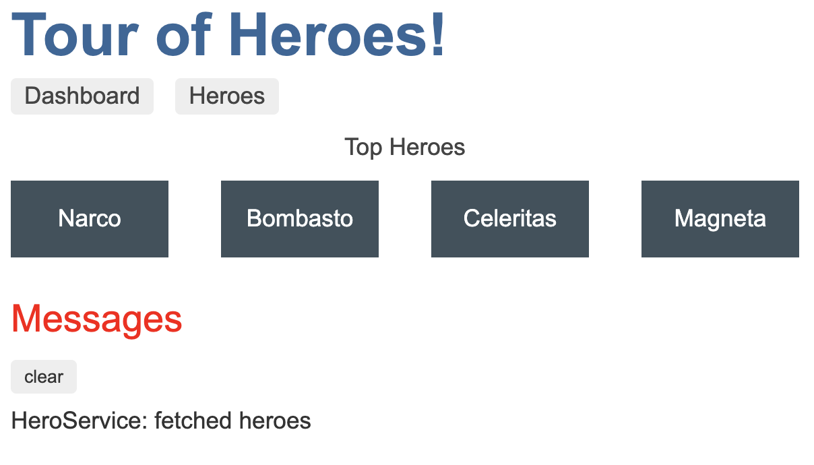
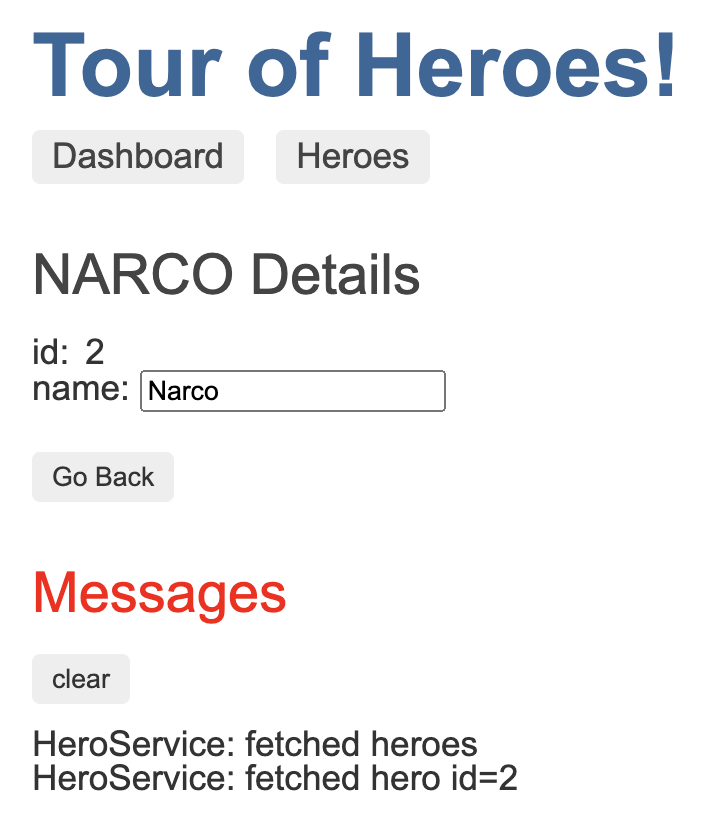
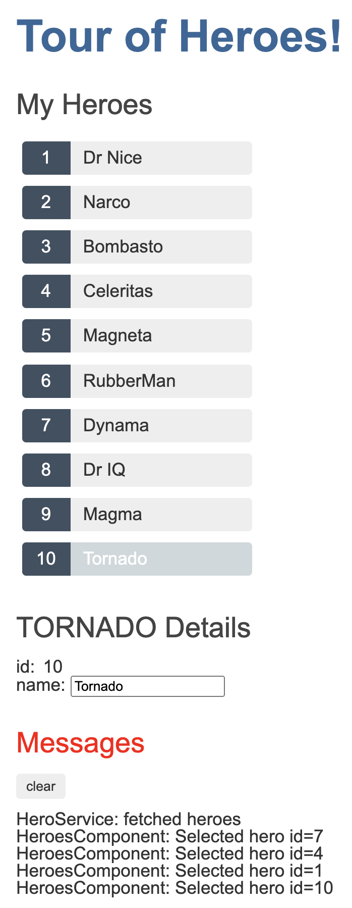
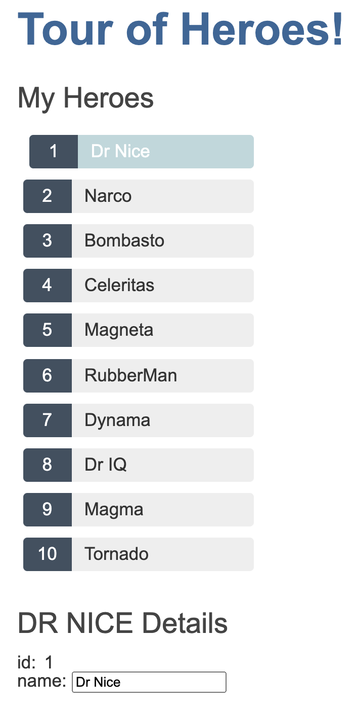

# Welcome 👋

This project was proposed after a first round interview as an introduction to Angular.

Thank you _**Anonymous Company**_ for the opportunity to interview with you and welcome to my project!

---

During the interview I was asked about my `process of learning` new technologies and would like to elaborate on my initial answer of `using the official documentation to work through small projects`. Reflecting on how I approached this project has highlighted that I have actually added a step prior to diving into code or the official documentation.

I now usually start learning a new technology by finding a highly rated course online. Even if the course is centered around building a project (vs just covering concepts) I will just watch the entire course (usually on 2x speed) and take **as many notes as possible**

This allows me to become familiar with the lingo / buzzwords that are used when approaching different concepts within the particular technology at hand. Additionally, through my time at Lambda all of my notes are compiled into a private repo that I call my `codebrain`.

While continuously pausing the lecture or stopping the project to take notes initially slows down my progress, I have seen that in the long run it dramatically increases the speed my development process. I am either able to immediately retrieve information which is already structured in my preferred format or I can better target the official documentation to learn more granular details as needed (and update my notes accordingly).

---

## Project Timeline
<details>
<summary>0.7.0 - Simulating HTTP Request w/ angular-in-memory-web-api<summary>

1. Creating @Injectable `InMemoryDataService` with imported mock array of Hero interface types
2. Udpated `heroesData.service.ts`
    - `getHeroes()` & `getHero()` are both using `HttpClient` to retrieve data through a RxJS Observable
        - Utilizing a `pipe` to handle errors
        - Utilizing a `tap` to call messageService which has been consolidated into a `private log()` util method

</details>

<details>
<summary>0.6.0 - Hero Detail Routing</summary>

1. Added `getHero(id)` method to `heroesDataService`
2. Added `detail/:id` route to `app-routing.module.ts`
3. Cleaned `heroes.component.html` & `heroes.component.ts` of any selection logic now that routerLink will send the user to the appropriate route
4. Updated `hero-detail.component.ts`
    - Getting selected hero ID from the `paramMap.get()` provided through  the `ActivatedRoute` import. ID is being passed into local `getHero()` method which is called in `ngOnInit()` and using `heroDataService.getHero()`
    - Added `goBack()` method to return to previous page through the `Location` import

Screenshots:

1. Dashboard:  
    

2. Hero Detail:    
    

</details>

<details>
<summary>0.5.0 - Initial Routing</summary>

1. Added 3 routes to `app-routing.module.ts`
    - path: '' => redirects to '/dashboard'
    - path: 'dashboard' => `DashboardComponent`
    - path: 'heroes' => `HeroesComponent`
2. `app.compoent.html`
    - Replaced `<app-heroes>` element with `<router-outlet>` element
    - Added 2 `routerLinks`
        1. '/heroes'
        2. '/dashboard'
3. Created `DashboardComponent` that is using the `HeroesDataService and rendering the name of heroes from index 1-5

</details>

<details>
<summary>0.4.0 - Messages Service & Messages Component</summary>

1. `message.service.ts` added to services directory
    - Property: array of strings representing a cache of messages
    - Methods
        1. add() => pushes new message into cache
        2. clear() => removes all messages from cache

2. `heroData.service` using `message.service` to log requests for heros
3. `heroes.component` using `message.service` to log when a user selects an individual hero
4. Added `messages` component which is rendering in the `app.component.html` through an `*ngIf` if the messages cache is not empty

Screenshot:  
    

</details>

<details>
<summary>0.3.1 - Heroes Data Service w/ RxJS Observable</summary>

1. `heroesData.service.ts` is now using RxJS with an `Observable` return type and simulate the asynchronous fetching of data
2. `heroes.component.ts` is subscribing to the returned `Observable` and only updating `this.heroes` when data is returned

</details>

<details>
<summary>0.3.0 - Heroes Data Service</summary>

1. Created `services` directory
    - Added `heroesData.service.ts`
        - `@Injectable()` created the service and defined its injector as the root injector
        - `getHeros()` is returning a mocked array of Hero interface types
    - `heroes.component.ts` is requesting an injection of the `herosData` service and using the service in the `ngInit()` lifecycle method

</details>

<details>
<summary>0.2.1 - Hero Detail SubComponent</summary>

1. `hero-detail` component is now responsible for all logic relating to a selected hero
    - `heroes.component.html` is using `one-way property binding` to pass a a selectedHero to the `hero-detail` component
    - `hero-detail` is recieving the `one-way property binding` through an `@input()` which expects the passed data to be of the Hero interface type
2. `heros` is only responsible for displaying list of heros

- New (truncated and rearranged) `src` directory

```
    ├── src
    │   ├── app
    │   │   ├── app.component.html
    │   │   ├── app.component.less
    │   │   ├── app.component.spec.ts
    │   │   ├── app.component.ts
    │   │   ├── app.module.ts
    │   │   └── heroes
    │   │       ├── hero-detail
    │   │       │   ├── hero-detail.component.html
    │   │       │   ├── hero-detail.component.less
    │   │       │   ├── hero-detail.component.spec.ts
    │   │       │   └── hero-detail.component.ts
    │   │       ├── heroes.component.html
    │   │       ├── heroes.component.less
    │   │       ├── heroes.component.spec.ts
    │   │       └── heroes.component.ts
    │   ├── __mocks__
    │   │   └── heroes.mock.ts
    │   ├── interface
    │   │   └── hero.interface.ts
    │   ├── styles
    │   │   ├── cssReset.css
    │   │   ├── global.less
    │   │   └── variables.less
    │   ├── styles.less
```

</details>

<details>
<summary>0.2.0 - Hero List</summary>

1. Created separate `styles` directory
    - Moved `CSS Reset` & `Global Styles`
    - Added LESS Variables
        - Font Sizing
        - Font Colors
        - Background Colors
2. Mocking array of 10 heros based on imported Hero type interface
3. `heroes.component.html`
    - Rendering unordered list of 10 heroes
    - List styling accommodates up to `id: 10000`
    - on selection of a single hero `*ngIf` displays selected hero content and exposes the ability to upate the selected hero

Screenshot:  
    
</details>

<details>
<summary>0.1.0 - Project Initialization</summary>

**StartTime:** Early Afternoon - Saturday 10/17

1. Angular CLI Installed w/ `@latest`
    - Angular CLI: 10.1.7
    - Node: 12.14.1
2. App Created
    - No Initial Routing
    - LESS Styling
3. CSS Reset w/ Meyers Reset v2.0

</details>

<details>
<summary>Pre-Project Course</summary>

**Course Name:** [Angular - The Complete Guide (2020 Edition)](https://www.udemy.com/course/the-complete-guide-to-angular-2/)  
**Course Author:** [Maximilian Schwarzmüller](https://www.udemy.com/course/the-complete-guide-to-angular-2/#instructor-1)

**StartTime:** After Internship - Friday 10/16  
**EndTime:** Early Afternoon - Saturday 10/17
</details>
